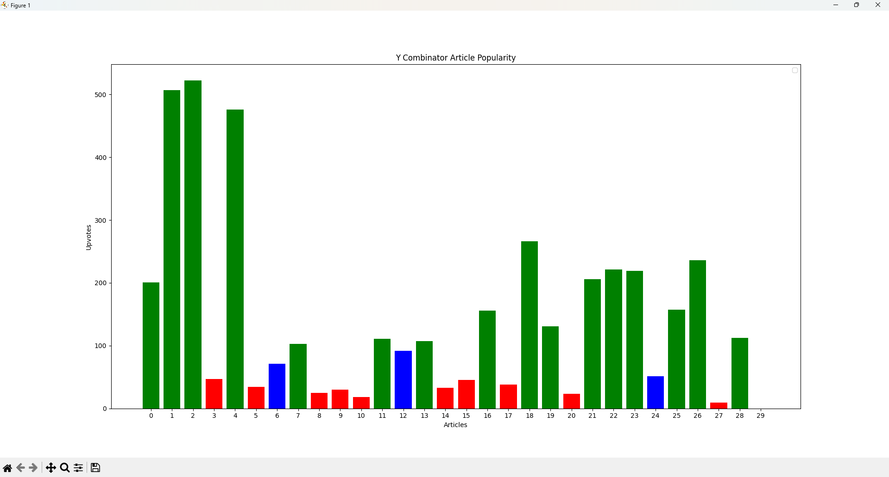

# Python Basic Web Scraper

Basic web scraper coded in Python with Beautiful Soup 2024

- Scrape a site using Beautiful Soup
- Cleanse the data for Pandas usage
- Plot the data using MatPlotLib

Output:
Main page of Y Combinator is scrapped, and we visualize whether the first page articles are actually getting hits or not depending on their upvotes. The bar chart produced from the scraped data gives us a quick visual overview of how effective the main page is or if the articles are duds.



Note: As the article names can be too long to place in the x-axis, we're just using the DataFrame index. The articles from the main page (top to bottom) are mapped from left to right. Left being the top most article and right being the bottom most article

## Requirements 📜

- Python 3.11++
- Beautiful Soup
- requests
- html5lib

Optional:

- Bash terminal
- Visual Studio Code

## Setup 🔧

When running this codebase, it was originally coded on a Windows 11 machine with Python 3.12.4 using Visual Studio Code.

You can check your version with: `python --version`

You will want to setup a Python environment in VSC. To do this:

- Ctrl + Shift + P
- Find `Python: Create Environment...`
- Choose `.venv`
- Select interpreter (in this case Python 3.12.4)

If you have any terminals open in Visual Studio Code, you will want to relaunch them to allow the virtual environment to take effect.

## Install dependencies

```
pip install beautifulsoup4
```

```
pip install requests
```

```
pip install html5lib
```

```
pip install pandas
```

```
pip install matplotlib
```

## How to Run 🏃

- Open a terminal and cd to the directory that contains app.py
- Run `python app.py`
- Done!

Alternatively:

- Open the `app.py` file in VSC
- Click on the Play button to the top right
- Let VSC work its magic and done!
